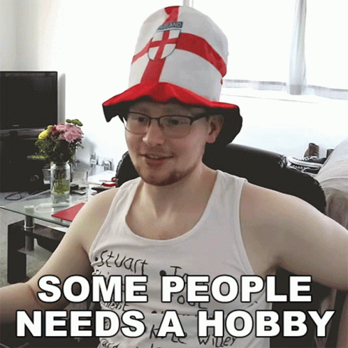

# Hi, I am Rafael!

Hello!! I am currently doing the last year of my master in computer science with emphasys in AI and Data Science at Paris Dauphine and ENS (École Normale Supérieure). I've being studying AI, Data Science and Image Processing since last year, when I came to France to an exchange year with Télécom Paris. 

  
  

## 🌱 What I'm Currently Learning
- Advanced GAN topics: cycle GANs, conditional GANs;
- Transformers;
- Advanced Mathematics for Machine Learning;
- Reinforcement learning;
- Plenty deep learning algorithms :)

## Some of my projects

<table>
  <tbody>
    <tr>
      <td align="center">
        <a href="https://github.com/rs-benatti/CarRacing_Deep_Q_Network">
          
          
           
          CarRacing_Deep_Q_Network
        </a>
      </td>
      <td align="center">
        <a href="https://github.com/thalisrocha/app-vlc-receiver">
          
           
          app-vlc-receiver
        </a>
      </td>
    </tr>
    <tr>
      <td align="center">
        <a href="https://github.com/thalisrocha/Kaggle-cmri-classification">
          
           
          Kaggle-cmri-classification
        </a>
      </td>
      <td align="center">
        <a href="https://github.com/V-kr0pt/Hyperspectral_image_super_resolution">
          
           
          Hyperspectral_image_super_resolution
        </a>
      </td>
    </tr>
    <tr>
      <td align="center">
        <a href="https://github.com/thalisrocha/Multimedia-set-top-box">
          
           
          Multimedia-set-top-box
        </a>
      </td>
      <td></td> <!-- Empty cell to maintain the layout -->
    </tr>
  </tbody>
</table>

### Deep Learning
- Deep Learning architecture for hyperspectral images super resolution
- Latent Reweighting in GANs
- Generative Neural Samplers using Variational Divergence Minimization
- Deep Matrix Factorization for recommendation system

### Computer vision
- 

 
    
   

## 🏂🏄⚽🏐 My hobbies

  
  

- I love doing almost every sport you can imagine!
- I also really enjoy cooking special meals
- Last but not least, sometimes I like studying languages
